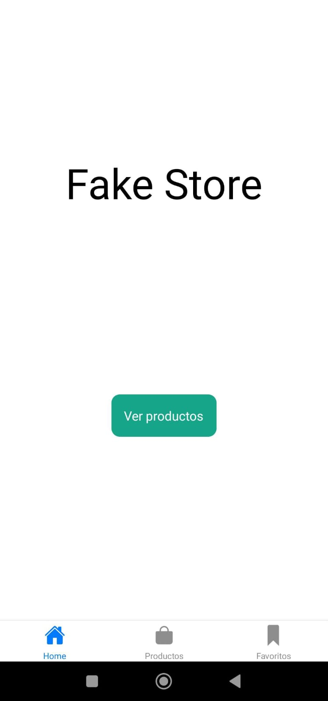
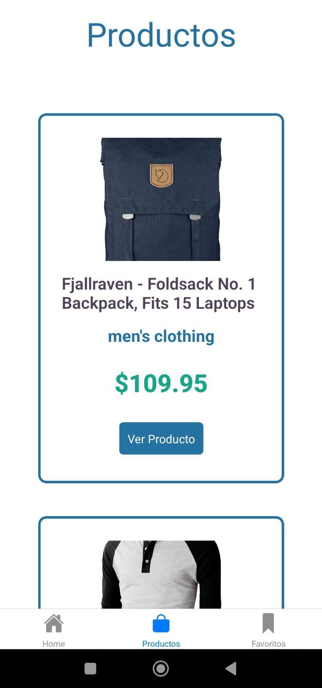
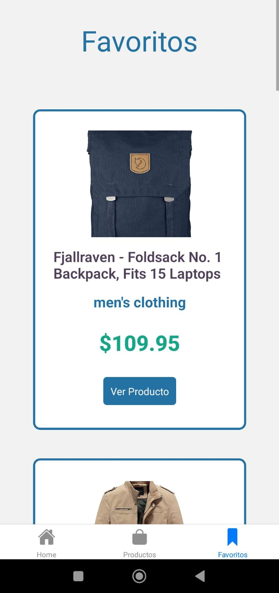
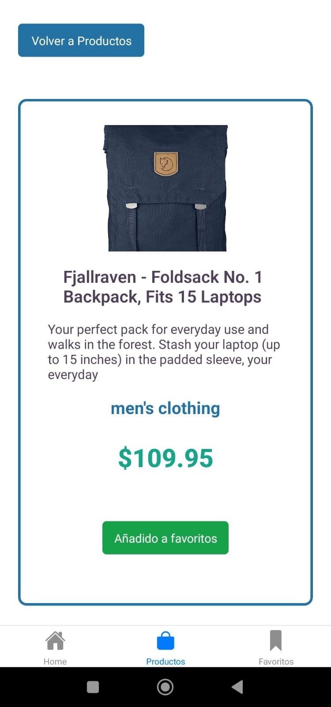

# MOBILE FAKE STORE

Una app móvil hecha con React Native consumiendo la API de [Fake Store API](https://fakestoreapi.com/) y usando el Async Storage para almacenar los productos favoritos.

    

    

    

    

